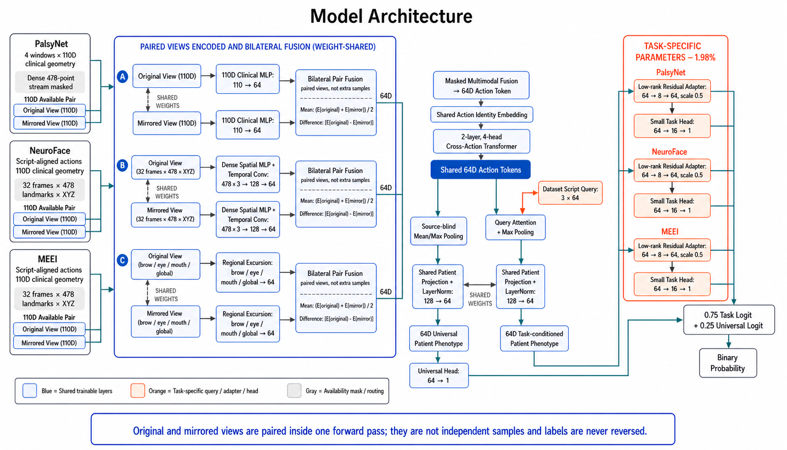

# Model Architecture

Model: V8 Residual Shared Clinical Router

> Scope: model structure only. This document intentionally excludes training
> results, clinical-performance claims, and promotion decisions.



## 1. Input representation

| Dataset path | Per-action representation | Dense availability |
|---|---|---|
| PalsyNet | Four windows, each represented by a 110D clinical-geometry vector | Explicitly masked |
| NeuroFace | Script-aligned actions with a 110D vector and 32 frames of 478 XYZ landmarks | Available |
| MEEI | Script-aligned actions with a 110D vector and 32 frames of 478 XYZ landmarks | Available |

Every available action is represented in its observed and mirrored views.

### Bilateral pair fusion

Each branch applies the same weight-shared encoder to the original and mirrored
views before pairing them inside one forward pass:

```text
e_original = Encoder(original_view)
e_mirrored = Encoder(mirrored_view)

paired_mean       = (e_original + e_mirrored) / 2
paired_difference = |e_original - e_mirrored|
```

The mean retains direction-independent evidence, while the absolute difference
retains bilateral disagreement. The mirrored view is not an additional sample,
and its label is never reversed. This pair fusion is applied separately to the
110D clinical, dense spatial-temporal, and regional-excursion branches.

## 2. Shared source-blind action encoder

All datasets use the same trainable action encoder:

1. **110D clinical branch:** `110 → 64` multilayer perceptron.
2. **Dense branch:** per-frame `478 × 3 → 128 → 64` spatial projection,
   followed by two temporal convolutions and mean/max temporal pooling.
3. **Regional branch:** brow, eye, mouth, and whole-face excursion statistics
   are projected to 64 dimensions.
4. **Masked multimodal fusion:** available branches are fused into one 64D
   action token; missing dense evidence is represented by an availability mask.
5. **Action identity:** a shared learned action embedding is added to every
   action token.
6. **Cross-action encoder:** a two-layer, four-head Transformer produces the
   shared 64D action-token sequence.

No dataset-specific adapter or output head is present in this encoder.

## 3. Patient-level pooling

The shared action tokens enter two parallel paths.

### Task-conditioned path

A dataset/script query selects the relevant action-token mixture through query
attention. The attended token and masked maximum token are concatenated and
passed through a shared `128 → 64` patient projection and LayerNorm:

```text
Shared action tokens
  → task query attention + max pooling
  → shared patient projection + LayerNorm
  → 64D task-conditioned patient phenotype
```

Only the three 64D query vectors are task-specific; the action tokens, pooling
operation, patient projection, and normalization weights are shared.

### Universal path

The same action tokens are pooled without a dataset query using masked mean and
maximum pooling. The pooled vector uses the same shared patient projection and
LayerNorm, followed by a shared universal linear head:

```text
Shared action tokens
  → source-blind mean/max pooling
  → shared patient projection + LayerNorm
  → 64D universal patient phenotype
  → universal head: 64 → 1
```

## 4. Task-specific residual branches

PalsyNet, NeuroFace, and MEEI each have one small residual adapter and one small
binary head. For task `t`:

```text
z_t' = z_t + 0.5 × Linear(8 → 64)(GELU(Linear(64 → 8)(LayerNorm(z_t))))

task_logit_t = Linear(16 → 1)(GELU(Linear(64 → 16)(z_t')))
```

The adapter begins only after the shared action-token encoder and shared patient
projection. Its rank-eight bottleneck limits the amount of task-specific
capacity.

## 5. Output composition

The selected task logit is combined with the universal logit before the sigmoid
output:

```text
final_logit = 0.75 × task_logit + 0.25 × universal_logit
binary_probability = sigmoid(final_logit)
```

## 6. Parameter-sharing boundary

| Parameter group | Parameters | Share |
|---|---:|---:|
| Shared encoder, patient projection, and universal head | 348,935 | 98.02% |
| Three script queries, residual adapters, and task heads | 7,035 | 1.98% |
| **Total** | **355,970** | **100%** |

Dataset identity therefore enters only through the small script query,
rank-eight residual adapter, and task head. The full action encoder and patient
projection are jointly shared.
