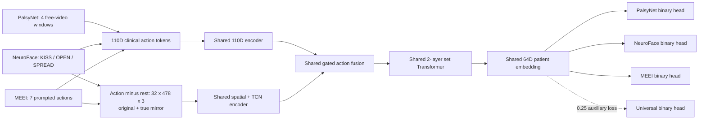

# Dense-Clinical Shared Encoder v1 — H200 result

## Decision

This experiment successfully built a genuinely shared trainable encoder, but it
did **not** outperform Universal Clinical Router v6. V6 therefore remains the
current primary development model. The shared candidate is retained as a
negative, reproducible transfer experiment and is not promoted.

## Architecture tested

Each action first produces a stable 110D clinical-geometry token. NeuroFace and
MEEI additionally provide the full baseline-centered `32 x 478 x 3` MediaPipe
trajectory from both the original and true-mirror video; PalsyNet uses the 110D
branch because its authenticated cache has no full mesh. Shared clinical and
dense encoders fuse each action, a shared two-layer set Transformer pools all
actions into one 64D patient embedding, and only then do three small binary
heads separate the dataset endpoints. A low-weight universal auxiliary head
keeps the shared embedding aligned. Source identity never enters the shared
encoder.

## Three-seed participant-disjoint result

Values are mean accuracy across seeds 0/1/2; every seed used the same six
participant-disjoint folds and 20 full-batch updates.

| Candidate | PalsyNet | NeuroFace | MEEI |
|---|---:|---:|---:|
| Shared 110D-only | 89.47% | 74.07% | 83.93% |
| Shared dense + clinical | 89.47% | 82.41% | 83.93% |
| Frozen V6 descriptive reference | 94.74% | 94.44% | 94.64% |

The full mesh clearly helps NeuroFace, but the neural shared trunk is unstable
on only 130 participants and does not preserve MEEI performance. Increasing to
100 updates worsened the result, and global per-landmark statistic pooling or a
near-zero dense residual also failed; these were not retained.

## Next correct experiment

Do not continue tuning this network on the same 130 participants. The next
version should reuse V6's proven action-statistic adapters as the dataset/script
front ends, map their outputs into one shared clinical latent space, and keep
only small endpoint heads after that latent. When Mayo HB labels arrive, attach
a new ordinal Mayo head to the frozen/shared latent and train it with
participant-disjoint splits; Mayo was not read or scored in this experiment.

Machine-readable evidence: [report.json](artifacts/dense_clinical_shared_encoder_v1/report.json)
