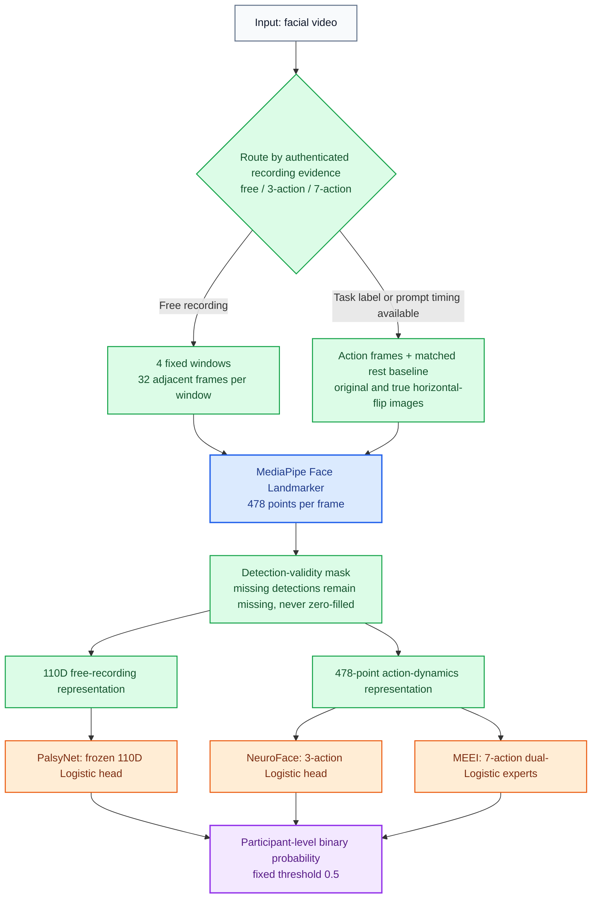
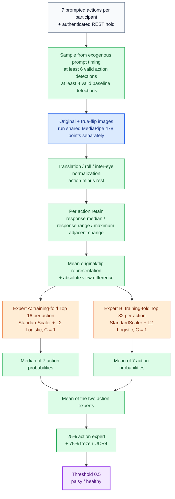
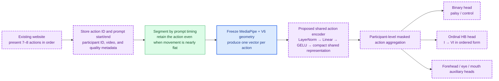

# Universal Clinical Router v6: Architecture, Evidence, and Mayo/HB Plan

**English** | [中文](universal_clinical_router_v6_mayo_brief_zh.md)

## One-sentence summary

Universal Clinical Router v6 (V6) adds full-mesh, action-conditioned 478-landmark experts to the frozen Landmark 110D baseline. It exceeds 94% participant-disjoint development accuracy in all three cohorts, but the branches currently share only the frozen MediaPipe weights and fixed geometry methods—not a trainable neural trunk. Mayo was not used to train V6, and Mayo binary accuracy cannot yet be calculated.

## Legend

| Color | Meaning |
|---|---|
| Blue | Shared, frozen model weights |
| Green | Fixed algorithm with no trainable parameters |
| Orange | Layer fitted separately for the current evidence profile |
| Purple | Proposed future Mayo/HB layer; not yet trained |

## 1. Overall V6 architecture

The blue MediaPipe Face Landmarker is the only learned weight set shared by every current branch. Green layers reuse fixed geometry procedures. The three orange classification heads are fitted independently and do not share parameters. V6 is not a Transformer, TCN, or end-to-end video network; its final estimators remain compact L2 Logistic Regression models.

| Layer | PalsyNet | NeuroFace | MEEI | Same trainable weights shared? |
|---|---|---|---|---|
| MediaPipe 478-point detection | Used, frozen | Used, frozen | Used, frozen | **Yes** |
| Temporal segmentation | 4 fixed windows | 3 task recordings | 7 prompted actions + REST | No; all are fixed rules |
| Geometry representation | 23 channels → 110D | Full-mesh bilateral dynamics | Full-mesh per-action dynamics | No; the last two share code but no learned weights |
| Classifier | 110D Logistic | 3-action Logistic | 7-action dual-Logistic experts | **No; fitted separately** |
| Final fusion | Original/mirror mean | 50% action + 50% UCR4 | 25% action + 75% UCR4 | No; weights are fixed, not learned |

## 2. PalsyNet: free-recording Landmark 110D branch

```mermaid
flowchart LR
    A[Free-recording video]:::input --> B[4 fixed temporal windows<br/>32 adjacent frames each]:::fixed
    B --> C[Shared frozen MediaPipe<br/>478 points + detection mask]:::shared
    C --> D[23 clinical geometry channels<br/>bilateral eye, brow, and mouth measures]:::fixed
    D --> E[4 statistics per channel<br/>median / IQR / range / maximum velocity<br/>23 × 4 = 92D]:::fixed
    D --> F[6 bilateral trajectory pairs<br/>correlation / amplitude ratio / time lag<br/>6 × 3 = 18D]:::fixed
    E --> G[Concatenate to 110D]:::fixed
    F --> G
    G --> H[Original + geometric-mirror views<br/>equal participant weight during fitting]:::fixed
    H --> I[StandardScaler<br/>fit only in the current training fold]:::head
    I --> J[L2 Logistic Regression<br/>C = 0.01]:::head
    J --> K[Mean original/mirror probability]:::fixed
    K --> L[Threshold 0.5<br/>palsy / unaffected]:::output

    classDef input fill:#F8FAFC,stroke:#64748B,color:#0F172A;
    classDef shared fill:#DBEAFE,stroke:#2563EB,color:#1E3A8A,stroke-width:2px;
    classDef fixed fill:#DCFCE7,stroke:#16A34A,color:#14532D;
    classDef head fill:#FFEDD5,stroke:#EA580C,color:#7C2D12;
    classDef output fill:#F3E8FF,stroke:#9333EA,color:#581C87,stroke-width:2px;
```

- **Development fitting/evaluation:** 39 recordings from 38 reviewed identity groups in four patient/group-disjoint folds; 21 affected and 17 unaffected participants.
- **Treatment in V6:** this branch is inherited unchanged and remains frozen.

## 3. NeuroFace: three-task branch

```mermaid
flowchart LR
    A[3 task videos per participant<br/>KISS / OPEN / SPREAD]:::input --> B[Authenticate task identity<br/>label-blind first/last edge frames form baseline]:::fixed
    B --> C[Original + true-flip images<br/>run MediaPipe 478 points separately]:::shared
    C --> D[Translate to eye midpoint<br/>roll-align eye line<br/>normalize by inter-eye distance]:::fixed
    D --> E[Bilateral action-minus-baseline statistics<br/>range, lower side, higher side, ratio, paired difference]:::fixed
    E --> F[Concatenate KISS / OPEN / SPREAD<br/>one participant vector]:::fixed
    F --> G[Training-fold F-test ranking<br/>retain Top 64 only]:::head
    G --> H[StandardScaler]:::head
    H --> I[Class-balanced L2 Logistic<br/>C = 10]:::head
    I --> J[50% dense-action probability<br/>+ 50% frozen UCR4 probability]:::fixed
    J --> K[Threshold 0.5<br/>neurological impairment / healthy]:::output

    classDef input fill:#F8FAFC,stroke:#64748B,color:#0F172A;
    classDef shared fill:#DBEAFE,stroke:#2563EB,color:#1E3A8A,stroke-width:2px;
    classDef fixed fill:#DCFCE7,stroke:#16A34A,color:#14532D;
    classDef head fill:#FFEDD5,stroke:#EA580C,color:#7C2D12;
    classDef output fill:#F3E8FF,stroke:#9333EA,color:#581C87,stroke-width:2px;
```

- **Development fitting/evaluation:** 36 participants with three tasks each in six participant-disjoint folds; 25 neurologically affected and 11 healthy controls.
- **Key detail:** the three tasks are combined into one participant vector before fitting one head. Feature ranking, scaling, and fitting use only the current training fold.

## 4. MEEI: seven-scripted-action branch

- **Development fitting/evaluation:** 56 of 60 participants pass the frozen action-timing quality gate and enter six participant-disjoint folds; 46 affected and 10 healthy controls.
- **Key detail:** each action receives its own classifier. The two experts differ in retained feature count and action-level aggregation; they are not two large neural networks.

## 5. Training cohorts and results

V6 does **not** pool all three datasets into one fitted model. It selects a branch from authenticated recording evidence. Each branch is fitted only on the training participants of its own cohort and produces out-of-fold predictions for unseen participants.

| Dataset and task | Data used for fitting | V6 participant-disjoint accuracy | Balanced accuracy | AUROC |
|---|---:|---:|---:|---:|
| PalsyNet, free-recording binary task | 38 identity groups; 21 affected, 17 unaffected | 36/38 = **94.74%** | 95.24% | 98.04% |
| NeuroFace, 3-task neurological-impairment binary task | 36 participants; 25 affected, 11 healthy | 34/36 = **94.44%** | 96.00% | 98.91% |
| MEEI, 7-action facial-palsy binary task | 56 participants; 46 affected, 10 healthy | 53/56 = **94.64%** | 96.74% | 94.57% |
| Mayo | **Not used to fit or select V6** | Not calculable | Not calculable | Not calculable |

These cohorts were exposed during architecture research, so the values are development evidence—not three independent external-test estimates. The historical PalsyNet sealed outer test produced 9/10 correct predictions, but V6 did not reopen that protected split; it is therefore not a new V6 test result.

### What can currently be reported for Mayo?

| Mayo evidence | Result | Correct interpretation |
|---|---:|---|
| Deduplicated, scoreable videos | 47 | All are currently treated as positive or suspected-positive; there are no verified negative controls |
| Frozen 110D/UCR4 positive calls | 45/47 = **95.74%** | **Positive-call rate**, not binary accuracy |
| V6 3-action/7-action branch | 0 predictions | Mayo action timing has not passed its use gate; V6 records zero Mayo reads |
| HB grading | None | HB labels have not yet been received |

It is incorrect to report “95.74% Mayo binary accuracy.” The defensible statement is: **the older frozen 110D branch called 45 of 47 videos positive in a cohort currently treated as positive, but without negative controls it cannot estimate accuracy, specificity, or AUROC.**

## 6. Short plan after Mayo House–Brackmann labels arrive

1. **Protocol-controlled website capture:** record prompt timestamps and action IDs for all 7–8 actions. Timing must come from the prompt, not observed movement, so severe near-flat responses remain valid attempts.
2. **Reuse first, then share:** keep frozen V6 geometry as the baseline, then train one compact action encoder shared across actions. Preserve dataset-specific binary heads and add a Mayo-specific ordinal HB head.
3. **Participant-level training:** use public cohorts to help the shared layer learn action capacity and use Mayo labels for the HB head. Every recording from one participant must remain in exactly one of train, validation, or test.
4. **One protected test:** first report 110D, action, and HB models separately; preregister any fusion afterward; then test once on untouched Mayo participants or another institution.

Under this design, the proposed purple action encoder would contain genuinely shared trainable weights, allowing public-cohort learning to help Mayo directly. Current V6 gains come primarily from reusable representation and routing design, not from an already shared intermediate neural representation.

## Reporting boundaries

- V6 is the active research candidate, but it is not independently clinically validated and has not replaced the protected default runtime entry point.
- NeuroFace predicts neurological impairment versus healthy control; MEEI and PalsyNet evaluate facial-palsy-related binary tasks. None is an HB grading task.
- Mayo requires participant-level HB labels, same-protocol healthy controls, and untouched test participants before binary or HB accuracy can be reported.

## Technical identifiers

- Candidate: `Universal Clinical Router v6 dense-action candidate`
- Frozen baseline: `Landmark 110D / Universal Clinical Router v4`
- Action representation: `dense_bilateral_action_v1`
- V6 aggregate report SHA-256: `f1f4368266db238b79bdd738baf68aeed7a1aff281f19f3f589fea942297b956`
