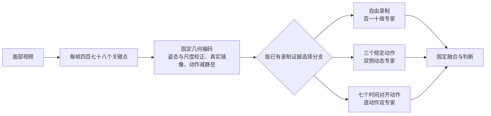
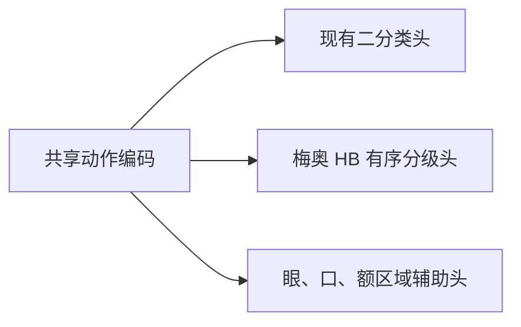

<!-- 面向中国医生 -->
# 第六版主模型与梅奥下一阶段：汇报简版

## 一句话结论

后续研究以第六版为主要基线：它保留第四版百一十维模型，同时加入完整四百七十八点动作几何，使三套受试者分离开发数据的正确率都超过百分之九十三；但这些仍是开发结果，不是梅奥临床验证。

## 第六版是怎么完成的

设计重点只有三点：

1. **保留可靠基线：** 自由录制分支完全沿用第四版，因此原有能力不退步。
2. **看完整动作变化：** 规定动作分支使用完整关键点，分别计算每个动作相对静息状态的幅度、范围、峰值和左右差异，避免异常被整段视频平均掉。
3. **分动作判断再融合：** 不同动作由对应专家分析，最后与冻结的第四版结果融合；判断阈值固定，不依靠事后调阈值提高分数。

| 受试者分离开发数据 | 第四版正确率 | 第六版正确率 |
|---|---:|---:|
| 自由录制数据 | 94.74% | 94.74% |
| 三动作数据 | 91.67% | 94.44% |
| 七动作数据 | 87.50% | 94.64% |

## 对梅奥项目的帮助

梅奥视频本身已有规定动作脚本，因此可以直接复用第六版的关键步骤：按脚本切分动作、建立静息基线、计算完整关键点动态、分别分析每个动作，并在受试者层面汇总。

拿到 House–Brackmann（HB）分级后，建议保留同一个动作编码流程，在其后新增一个梅奥专用的有序分级头；训练和验证必须按患者分离，不能让同一患者的视频同时进入训练与验证。

## 当前是否共享参数

**当前只共享处理方法，没有共享一个可训练的中间神经网络。**

| 部分 | 当前是否共享 | 含义 |
|---|---|---|
| 人脸关键点检测器 | 是，且冻结 | 所有分支使用同一个检测器 |
| 姿态校正、镜像和动作减静息 | 是，但没有可训练参数 | 这些改进可以直接复用于梅奥 |
| 中间可训练表示层 | 否 | 当前没有共同训练的神经网络主干 |
| 最终判断头 | 否 | 百一十维、三动作和七动作专家分别训练 |

因此，第六版对梅奥的帮助目前主要来自**更好的输入表示和动作建模方法**，而不是已经学到了一套能够直接迁移的共享参数。拿到 HB 标签后，下一步可以把三个数据集的动作表示接入一个小型共享主干，再保留二分类和 HB 分级各自独立的输出头；这样现有数据学到的动作能力才会通过共享权重真正帮助梅奥，同时避免把不同疾病和不同标签强行混成一个任务。

## 汇报边界

- 第六版是当前研究主线，但尚未在带有阴性对照和 HB 标签的梅奥队列中验证。
- 现有梅奥视频不能提供二分类正确率，也不能验证 HB 分级。
- 第六版配置曾参考现有开发数据，下一步最重要的证据是未参与开发的梅奥患者级验证。

## 技术名称对照

- 第六版：`Universal Clinical Router v6`
- 百一十维关键点分支：`Landmark 110D`
- 人脸关键点检测器：`MediaPipe Face Landmarker`
- House–Brackmann 分级：`HB grade`
