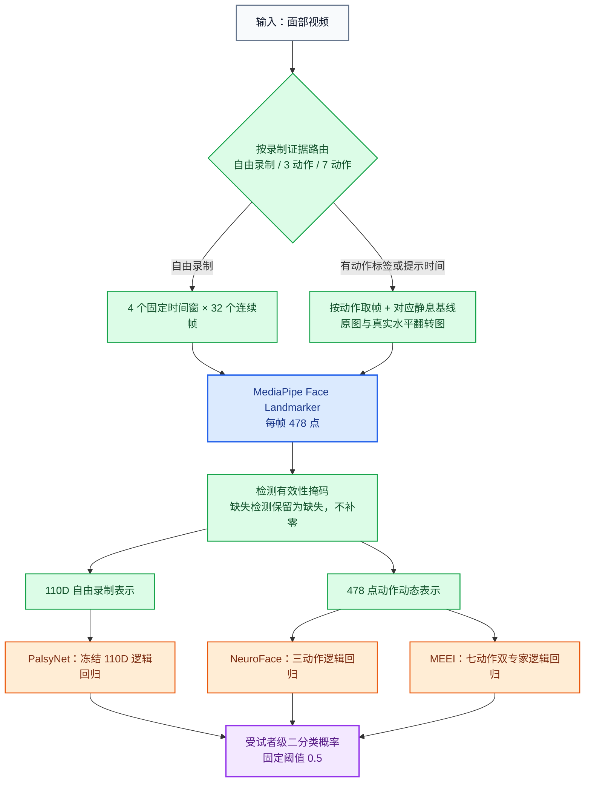
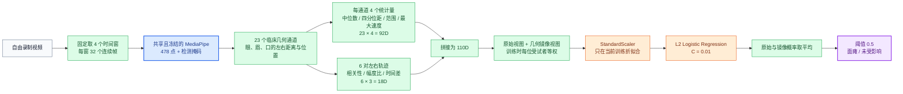
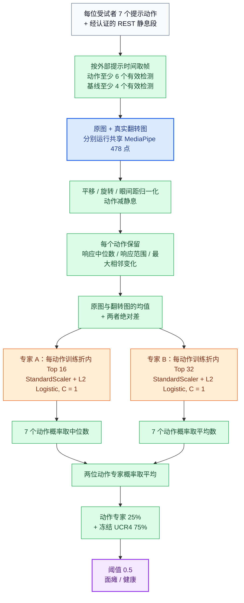
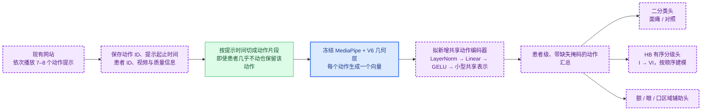

<!-- 面向中国医生 -->
# Universal Clinical Router v6：结构、数据与 Mayo/HB 计划

[English](universal_clinical_router_v6_mayo_brief_en.md) | **中文**

## 一句话结论

第六版（V6）是在冻结的 110D 基线上增加“完整 478 点、按动作建模”的轻量路由器：三套受试者分离开发数据的正确率均超过 94%，但三个分支目前**只共享冻结的 MediaPipe 权重和固定几何方法，不共享一个可训练神经网络主干**；Mayo 尚未参与 V6 训练，也没有可计算的二分类正确率。

## 图例

| 颜色 | 含义 |
|---|---|
| 蓝色 | 所有分支共享、已冻结的模型权重 |
| 绿色 | 固定算法，没有可训练参数 |
| 橙色 | 针对当前数据形态单独训练的层 |
| 紫色 | 未来 Mayo/HB 拟新增的层，尚未训练 |

## 1. V6 总体结构

**共享关系：** 蓝色 MediaPipe 是当前唯一真正共享的学习权重；绿色几何层是各分支复用的固定算法；三个橙色分类头分别训练，彼此不共享参数。V6 不是 Transformer、TCN 或端到端视频网络，最终判断层仍是小型 L2 Logistic Regression。

| 层 | PalsyNet | NeuroFace | MEEI | 是否共享同一组可训练权重 |
|---|---|---|---|---|
| MediaPipe 478 点检测 | 使用、冻结 | 使用、冻结 | 使用、冻结 | **是** |
| 时间切分 | 4 个固定窗口 | 3 个任务录制 | 7 个提示动作 + REST | 否；都是固定规则 |
| 几何表示 | 23 通道 → 110D | 完整 478 点双侧动态 | 完整 478 点逐动作动态 | 否；后两者共享表示代码，但没有学习权重 |
| 分类头 | 110D Logistic | 三动作 Logistic | 七动作双 Logistic 专家 | **否，分别拟合** |
| 最终融合 | 原图/镜像均值 | 50% 动作 + 50% UCR4 | 25% 动作 + 75% UCR4 | 否；权重固定，不参与训练 |

## 2. PalsyNet：自由录制 110D 分支

- **训练/验证：** 39 段开发录制、38 个身份组，4 折患者/身份分离；21 名受影响、17 名未受影响。
- **V6 中的处理：** 该分支完全冻结，V6 没有重新调整它。

## 3. NeuroFace：三个规定动作分支

- **训练/验证：** 36 名受试者、每人 3 个动作，6 折患者分离；25 名神经功能受影响、11 名健康对照。
- **关键点：** 三个动作先合成一个受试者向量，再训练一个分类头；特征选择、标准化和拟合都只看当前训练折。

## 4. MEEI：七个脚本动作分支

- **训练/验证：** 原始 60 名受试者中 56 名通过动作时间质量门槛，6 折患者分离；46 名受影响、10 名健康对照。
- **关键点：** 每个动作都有自己的分类器；两个专家的区别是保留特征数和动作汇总方式，不是两个大型神经网络。

## 5. 当前训练数据与结果

V6 **不是把三套数据混在一起训练一个模型**，而是按录制证据选择相应分支；每个分支都只在本数据集的训练折拟合，再对未见过的受试者生成折外预测。

| 数据集与用途 | 实际参与拟合的数据 | V6 受试者分离正确率 | 平衡正确率 | AUROC |
|---|---:|---:|---:|---:|
| PalsyNet，自由录制二分类 | 38 个身份组；21 受影响、17 未受影响 | 36/38 = **94.74%** | 95.24% | 98.04% |
| NeuroFace，三动作神经功能异常二分类 | 36 人；25 受影响、11 健康 | 34/36 = **94.44%** | 96.00% | 98.91% |
| MEEI，七动作面瘫二分类 | 56 人；46 受影响、10 健康 | 53/56 = **94.64%** | 96.74% | 94.57% |
| Mayo | **未参与 V6 拟合或选择** | 不可计算 | 不可计算 | 不可计算 |

这些是已经暴露并用于架构研究的开发结果，不是三个独立外部测试结果。PalsyNet 历史封存外层测试曾得到 9/10，但 V6 本轮没有重开该保护区，因此不能把它写成 V6 的新测试结果。

### 如果“Miyaout”指 Mayo：现在能报告什么

| Mayo 证据 | 结果 | 正确解释 |
|---|---:|---|
| 去重且可评分的视频 | 47 | 当前均按阳性/疑似阳性理解，没有已确认阴性对照 |
| 冻结 110D/UCR4 判为阳性 | 45/47 = **95.74%** | **阳性调用率**，不是二分类正确率 |
| V6 三动作/七动作分支 | 0 次预测 | Mayo 动作时间切分尚未通过使用门槛，V6 也明确保持 Mayo 读取为 0 |
| HB 分级 | 无 | 尚未获得 HB 标签 |

所以目前不能说“V6 在 Mayo 的 binary accuracy 是 95.74%”；严格说法是：**旧的冻结 110D 分支在 47 个暂按阳性理解的视频中检出 45 个，但没有阴性病例，无法计算正确率、特异度或 AUROC。**

## 6. 得到 Mayo House–Brackmann 标签后的简短计划

1. **网站固定采集：** 让网站记录 7–8 个动作的提示时间与动作 ID，直接作为切分依据；不能根据“患者是否明显运动”决定动作是否存在，否则会漏掉严重无力患者。
2. **先复用、后共享：** 先冻结 V6 的 MediaPipe 和几何层，以 V6 作为对照；再让所有动作共用一个很小的可训练编码器，不同数据集保留各自的二分类头，Mayo 新增 HB 有序分级头。
3. **患者级训练：** 公共数据先帮助共享层学习“动作能力”，Mayo 标签训练 HB 头；同一患者的所有视频必须只出现在训练、验证或测试中的一个集合。
4. **一次性验证：** 先分别报告 110D、动作模型和 HB 模型，再预注册融合；最后只在未参与选择的 Mayo 患者或另一机构队列上打开一次测试。

这样设计以后，真正共享的是紫色的**动作编码器权重**：公共数据上学到的动作表示才能直接帮助 Mayo；当前 V6 的提升主要来自可复用的表示方法和分支设计，还不是一套已经共享的中间权重。

## 汇报边界

- V6 是当前研究主线候选，但尚未得到独立临床验证，也没有替换受保护的默认运行入口。
- NeuroFace 的标签是神经功能异常与健康，MEEI/PalsyNet 是面瘫相关二分类；它们不是 HB 分级任务。
- Mayo 需要患者级 HB 标签、同协议健康对照和未参与开发的测试患者，才能报告二分类或 HB 正确性。

## 技术标识

- 第六版：`Universal Clinical Router v6 dense-action candidate`
- 冻结基线：`Landmark 110D / Universal Clinical Router v4`
- 动作表示：`dense_bilateral_action_v1`
- V6 汇总报告 SHA-256：`f1f4368266db238b79bdd738baf68aeed7a1aff281f19f3f589fea942297b956`
